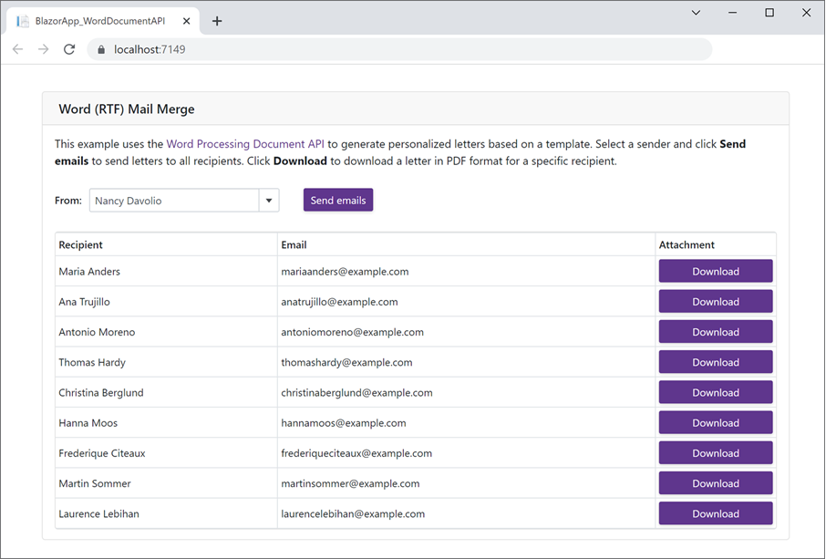

<!-- default badges list -->

<!-- default badges end -->
# Word Processing Document API – How to Generate and Send Business Letters within a .NET 6 Blazor Server App

This Blazor Server application uses the [Word Processing Document API](https://www.devexpress.com/products/net/office-file-api/word/) to generate multiple business letters based on a template. Users can download these letters in PDF format or send them via e-mail.

To run the application, you need to install or restore the following NuGet packages:

* [DevExpress.Document.Processor](https://nuget.devexpress.com/packages/DevExpress.Document.Processor/) - Contains the [DevExpress Office File API](https://www.devexpress.com/products/net/office-file-api/) libraries.

* [DevExpress.Blazor](https://nuget.devexpress.com/packages/DevExpress.Blazor/) - Contains all [DevExpress Blazor UI components](https://www.devexpress.com/blazor/).

* [MailKit](https://www.nuget.org/packages/MailKit/) - An open source .NET library used to send e-mail messages.

## Documentation

Refer to this help topic for implementation details: [Use the Word Document API to Generate and Send Business Letters within a Blazor Server App](https://docs.devexpress.com/OfficeFileAPI/403819/dotnet-core-support/use-word-document-api-within-a-blazor-server-app).

## Files to Look At

* [SampleData.cs](./CS/BlazorApp_WordDocumentAPI/Data/SampleData.cs)

* [Index.razor](./CS/BlazorApp_WordDocumentAPI/Pages/Index.razor)

## More Examples

* [Spreadsheet Document API - How to Create a Loan Amortization Schedule within a Blazor Server App](https://github.com/DevExpress-Examples/spreadsheet-document-api-create-loan-amortization-schedule-within-blazor-server-app)
* [How to Dockerize an Office File API Application](https://github.com/DevExpress-Examples/dockerize-office-file-api-app)
